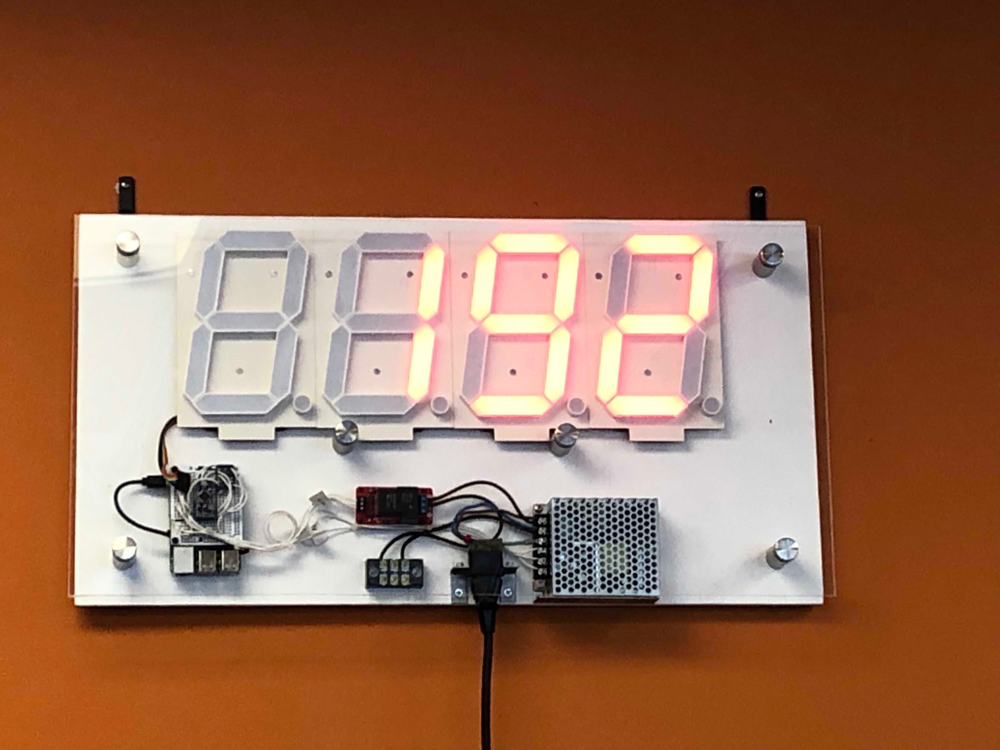

# lulo-sign

> A Sign to show the current Lulo Policy count.

## About

Obvioulsly the actual number of Lulo policies that exist is private confidintal data but this code which controls a 7-seg dislay sign is not.

This project uses [Feathers](http://feathersjs.com). An open source web framework for building modern real-time applications.

## REST API

[LuloSign-API.html](https://stejsoftware.github.io/lulo-sign/LuloSign-API.html)

## Changelog

**0.1.1**

- Various Changes ~ a work in progress

**0.1.0**

- Initial release

## License

Copyright (c) 2017

Licensed under the [MIT license](LICENSE).
